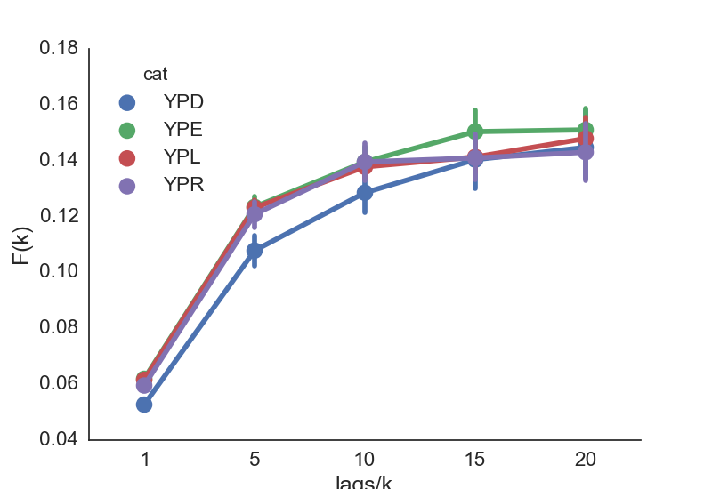

# What is in this repository?
**A set of open-source computational tools developed in Python to perform *multi-scale* analysis of *structure-function* relationship in mitochondrial networks.**

##Segmentation of mitochondrial networks from live yeast cells 3D images taken with a *spinning disk confocal* microscope.
This segmentation utilizes [MitoGraph](https://github.com/vianamp/MitoGraph.git), a C++ skeletonization and segmentation program developed by Matheus Viana. It has been fully validated in yeast cells. [*Viana, Lim et al*] (http://www.ncbi.nlm.nih.gov/pubmed/25640425). 

##Data Munging in Pandas for data exploration and visualization

###Modulation of mitochondrial function by altering carbon source growth conditions.

###Investigating tubule scale heterogeneity of mitochondrial membrane potential (Δψ).

###Analysis of mitochondrial functional asymmetry in mother and daughter yeast cells.

####Requirements
* Pandas
* Mayavi
* Numpy
* Seaborn
* Scipy
* VTK

The best way to ensure all dependencies are fulfilled is by installing the [Anaconda](https://www.continuum.io/downloads) Python package.

Images

Format: 
Links

http://github.com - automatic!
[GitHub](http://github.com)
Blockquotes

As Kanye West said:

> We're living the future so
> the present is our past.
Inline code

I think you should use an
`<addr>` element here instead.
